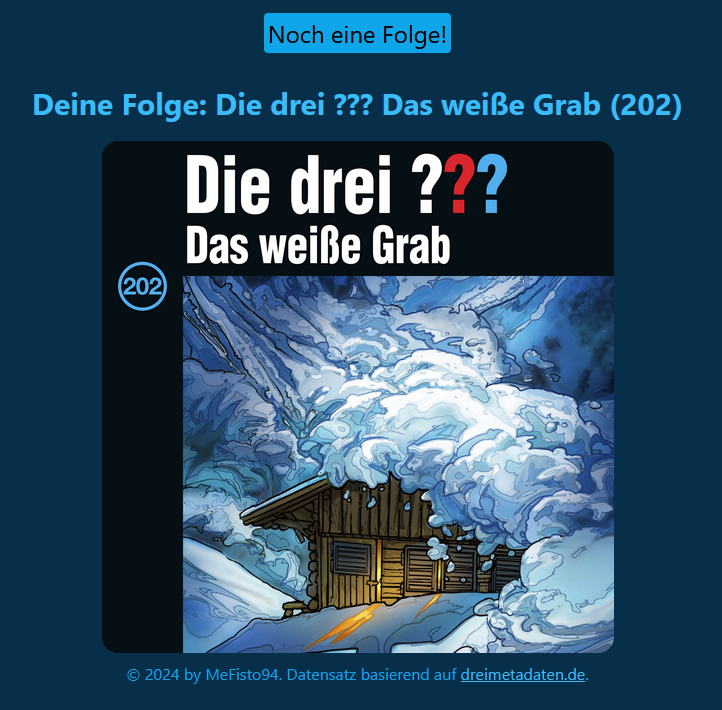

# Die Drei Fragezeichen Folgen Zufallsgenerator

Basierend auf einer [Datenbank](https://github.com/YourMJK/dreimetadaten) 
aller existierenden Folgen wird dem Nutzer eine zufällige Folge empfohlen.
Der Nutzer kann jederzeit eine weitere Zufallsfolge anfordern.

## Screenshot
